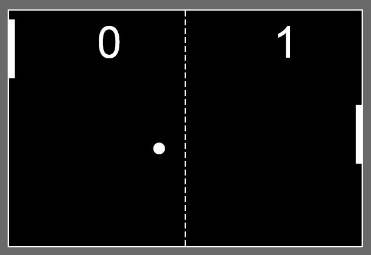

# Ping Pong Game

This is a basic ping pong game made with javaScript ,html and CSS .
 Also sounds effects are added in the game for user convenience.
 
---- 
 # Play online 
 https://codesandbox.io/s/github/jagrit2019/Black_berry_game
 
 ---
 # How to play
 
 Just use your mouse to control the pad and hit the ball.
 
 ---
 # Rules
 
 The aim of the player is to score against the computer while defending by using pads . Score is awarded if ball misses the pad and goes behind it.
 
 # Contribution
Pull requests are welcome. For major changes, please open an issue first to discuss what you would like to change.

Please make sure to update tests as appropriate.
=======
Simple Ping Pong Game Made with JavaScript. Can You Beat The Computer?
## Features
- Sounds for Enjoyable Gameplay.
- Smart Opponent for Realistic Gameplay.

## ScreenShot
</img>
## Contribute
- Feel free to Fork this repository.

